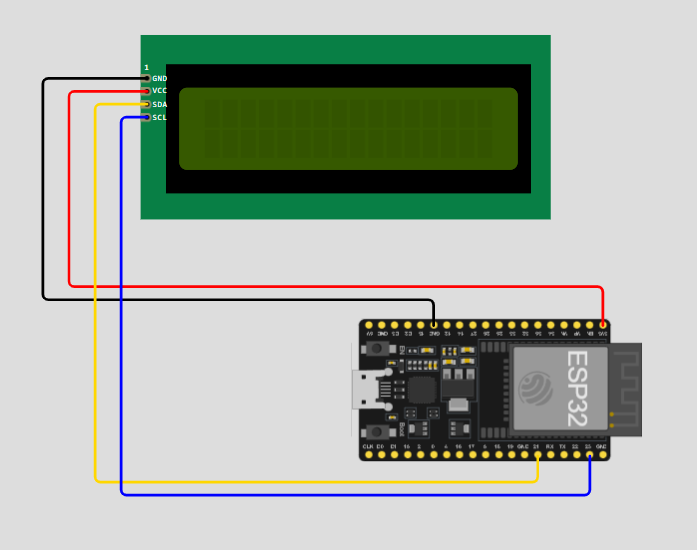

## Statement
Pharmaceutical companies, food distributors, and logistics warehouses suffer massive losses when temperature-sensitive goods are stored or transported under wrong conditions — and they only discover the damage after the fact. There is no real-time visibility into storage zones, and unauthorized access to restricted inventory goes unrecorded.

This project delivers a fully monitred, access controlled environment for warehouse facility. Continuously logging the sensors data, access and alerts the moment any parameter dwels out of range(gas leaks, Air quality, lockdown if no one is inside). The warehouse can be monitored and accessed remotely via wifi/hotspot (*must be in same network*)

# Day 1

Day 1, I ended the project by integrating LCD display(16x2) and the RFID tags, and servo motor(door) to work in response the RFID access granted or not. The system we will integrate multiple sensors and modueles to maintain **security and monitoring facility**.

## First and for most (Visualize) - LCD 16x2 

I choose this only because it was easy to build and i can get going and develop my pave into complex aspects of the projects.

==Note: == in the code **SDA and SLC** are initialized via `Wire(SDA_port,SLC_port);` and the lcd via `lcd.init()`

First part of building the system. correctly implementing the screen is necessary. All the information we will calculate and measure throught out PIR sensor, UltraSonic Sensors, Gas and smoke, DHT22 will be displayed over the LCD Screen. A function is made, when called prints the passed argument in LCD two lines.
The LCD dusplay has two lines to output to.

Here the components used till now are **ESP 32** and **LCD 16x2**.

## RFID - 